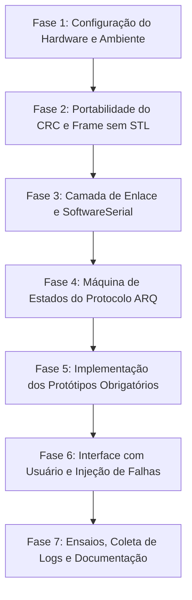

# Roadmap: Portando o PeerDuino para Arduino

Este documento estabelece o plano de ação detalhado para portar a implementação atual do **PeerDuino** (atualmente em C++23 com POSIX Sockets) para a plataforma **Arduino (ATmega328P / Uno / Nano)**, atendendo integralmente a todos os requisitos acadêmicos da especificação do professor para entrega e demonstração no dia **16 de Setembro**.

---

## 1. Diagnóstico do Código Atual vs. Requisitos do Arduino

### 1.1 O que o projeto possui hoje
- **Estrutura de Quadros (`include/frame.hpp` / `src/frame.cpp`)**:
  - Delimitadores `flag_start` (0x7E) e `flag_end` (0x7E).
  - Campos de cabeçalho: `src`, `dst`, `type` (`FrameType::DATA`, `ACK`, `NAK`, `FIN`), `seq` (uint16_t), `length` (uint16_t).
  - Cálculo de integridade com **CRC-16-CCITT** (`0x1021`).
  - *Limitação atual anotada no código*: não possui byte stuffing (escapamento de bytes), forçando o uso de codificação Hexadecimal para evitar que bytes `0x7E`/`0x7D` apareçam no payload.
- **Mecanismo de Confiabilidade (`include/arq.hpp` / `src/arq.cpp`)**:
  - Algoritmo **Go-Back-N (GBN)** com janela deslizante configurável.
  - Temporização baseada em `std::chrono::steady_clock`.
  - Simulação de perdas com `std::mt19937` e probabilidades.
- **Camada de Transporte (`include/socket.hpp` / `src/socket.cpp`)**:
  - Sockets TCP POSIX (`sys/socket.h`, `poll()`, `arpa/inet.h`).
- **Camada de Aplicação (`include/server.hpp`, `src/server.cpp`, `src/parse.cpp`)**:
  - Transferência de arquivos via CLI desktop.

---

### 1.2 O que a especificação do trabalho exige
1. **Comunicação Serial entre 2 Arduinos**:
   - Utilização de `SoftwareSerial.h` para o enlace entre os dois Arduinos, preservando a `HardwareSerial` (`Serial` USB) para comunicação e debug no Serial Monitor do PC.
2. **Protótipos Obrigatórios de Envio**:
   ```cpp
   bool sendByte(uint8_t value);
   bool sendWord(uint16_t value);
   bool sendFloat(float value);
   bool sendData(const uint8_t *data, uint16_t size);
   ```
3. **Identificação de Tipos no Receptor**:
   - O receptor precisa saber se o dado recebido é um `byte`, `word`, `float` ou buffer arbitrário (`data`) e exibi-lo corretamente.
4. **Confiabilidade Completa (ARQ)**:
   - Detecção de corrupção via CRC.
   - Tratamento de perda de pacotes e perda de confirmação (ACK) por timeout.
   - Retransmissão automática de mensagens.
   - Informar sucesso/falha e número de tentativas ao usuário.
5. **Demonstração Prática de Falhas**:
   - Criar cenários de testes controlados (desconexão de fios, injeção de ruído/erro de CRC, perda forçada de pacotes).
6. **Documentação Técnica**:
   - Relatório completo com decisões de projeto, estrutura dos quadros, máquinas de estados e resultados experimentais.

---

### 1.3 Matriz de Diferenças e Desafios de Portabilidade

| Recurso / Componente | Código Atual (Linux C++23) | Alvo no Arduino (AVR ATmega328P) | Impacto / Ação Necessária |
|---|---|---|---|
| **Ambiente de Memória** | Heap virtual ilimitado | **2 KB de SRAM** total | **Eliminar `std::vector` e `std::string`**. Alocar buffers estáticos fixos (`uint8_t payload[64]`). |
| **Biblioteca Padrão** | STL moderna (`<chrono>`, `<optional>`, `<random>`) | Avr-libc enxuta (sem STL padrão) | Usar `millis()` para temporização e funções C++ sem alocação dinâmica. |
| **Camada de Enlace** | Sockets TCP (`send`, `recv`, `poll`) | Serial Stream (`SoftwareSerial`) | Ler/escrever byte a byte com buffers circulares e timeouts não-bloqueantes. |
| **Delimitação de Quadros** | Flags `0x7E` com restrição de Hex | **Byte Stuffing (Escapamento 0x7D)** | Permitir transmissão transparente de binários brutos (floats e words). |
| **Tipagem de Mensagens** | Payload cego (bytes crus de arquivo) | **Campo `DataType` no Cabeçalho** | Permitir ao receptor saber se exibe int, float, byte ou array. |
| **Protocolo ARQ** | Go-Back-N com janela | **Stop-and-Wait ARQ (Janela = 1)** *(Recomendado)* | Os protótipos `sendByte(...)` são síncronos e retornam `bool`. Stop-and-Wait é imune a estouros de buffer na SoftwareSerial (buffer de 64 bytes). |

---

## 2. Decisões Críticas de Arquitetura

### Decisão 1: Por que adotar Stop-and-Wait ARQ no Arduino em vez de Go-Back-N completo?
1. **Semântica da API Solicitada**:
   A função `bool sendByte(uint8_t value)` é síncrona: ela envia o byte, aguarda confirmação e retorna `true` se foi entregue ou `false` se falhou após $N$ tentativas. Uma janela deslizante GBN multiquadros é assíncrona por natureza e só faria sentido em transmissões em rajada de arquivos longos.
2. **Gargalo de Hardware do SoftwareSerial**:
   A biblioteca `SoftwareSerial` possui um buffer de recepção interno de apenas **64 bytes**. Com GBN e janela $> 1$, múltiplos quadros chegando rapidamente sobrecarregam o buffer AVR por interrupção, causando perda de bytes por *buffer overrun*.
3. **Uso de Memória**:
   Stop-and-Wait precisa apenas de 1 buffer de transmissão e 1 de recepção ($< 150$ bytes de RAM), deixando o microcontrolador estável sem risco de fragmentação ou estouro de pilha (*stack overflow*).
4. **Alternativa Híbrida**:
   Utilizar a mesma estrutura de cabeçalho do código atual (`seq`), mas operando em regime de alternância de sequência (`seq = 0, 1, 2...`) com janela unitária.

### Decisão 2: Byte Stuffing (HDLC / SLIP) vs. Codificação Hexadecimal
- O código original utilizava `encode_hex()` para impedir que bytes de dados colidissem com `0x7E`.
- **Problema do Hex no Arduino**: Dobra o tamanho de todos os pacotes, reduzindo a taxa de transmissão efetiva pela metade em uma conexão serial já lenta (9600 bps).
- **Solução recomendada**: Implementar Byte Stuffing simples:
  - Flag de início/fim: `0x7E`
  - Byte de escape: `0x7D`
  - Se um byte no payload/cabeçalho for `0x7E`, transmite `0x7D, 0x5E` (`0x7E ^ 0x20`).
  - Se for `0x7D`, transmite `0x7D, 0x5D` (`0x7D ^ 0x20`).

---

## 3. Especificação do Novo Protocolo (PeerDuino-AVR)

### 3.1 Estrutura do Quadro de Dados e Controle

```
+----------+---------+---------+-----------+-----------+----------+-----------+---------+----------+
| START    | SRC     | DST     | FRAME_TYP | DATA_TYP  | SEQ_NUM  | LENGTH    | PAYLOAD | CRC-16   | END      |
| 1 byte   | 1 byte  | 1 byte  | 1 byte    | 1 byte    | 1 byte   | 1 byte    | N bytes | 2 bytes  | 1 byte   |
| 0x7E     | ID      | ID      | DATA/ACK  | B/W/F/RAW | 0..255   | 0..64     | Var     | CCITT    | 0x7E     |
+----------+---------+---------+-----------+-----------+----------+-----------+---------+----------+
```

#### Definição dos Campos:
1. `START` / `END`: Delimitadores `0x7E`.
2. `SRC` e `DST`: Endereço dos nós (ex: Arduino 1 = `0x01`, Arduino 2 = `0x02`).
3. `FRAME_TYP`:
   - `0x01`: `FRAME_DATA` (Quadro contendo carga útil)
   - `0x02`: `FRAME_ACK` (Confirmação de recebimento)
   - `0x03`: `FRAME_NAK` (Rejeição explícita por erro de CRC/fora de ordem)
4. `DATA_TYP` (Crucial para identificação no receptor):
   - `0x01`: `TYPE_BYTE` (1 byte)
   - `0x02`: `TYPE_WORD` (2 bytes, 16-bit unsigned int)
   - `0x03`: `TYPE_FLOAT` (4 bytes, IEEE-754)
   - `0x04`: `TYPE_DATA` (Buffer binário de $N$ bytes)
   - `0x00`: `TYPE_NONE` (Usado para quadros de controle ACK/NAK)
5. `SEQ_NUM`: Número sequencial incremental (uint8_t é suficiente para Stop-and-Wait / detecção de duplicatas).
6. `LENGTH`: Tamanho do payload sem stuffing (0 a 64 bytes).
7. `PAYLOAD`: Dados brutos.
8. `CRC-16`: Calculado sobre os campos `SRC` até o fim do `PAYLOAD` (usando o mesmo polinômio `0x1021` do seu `error.cpp`).

---

## 4. Fases de Execução do Port



---

### Fase 1: Configuração do Hardware e Ambiente
- [ ] **Esquema elétrico de ligação entre os dois Arduinos**:
  - Arduino A Pino 10 (RX) <---> Arduino B Pino 11 (TX)
  - Arduino A Pino 11 (TX) <---> Arduino B Pino 10 (RX)
  - Arduino A GND <---> Arduino B GND (**Atenção**: Terra compartilhado é obrigatório para estabilidade serial!).
  - Arduino A USB <---> PC (Monitor Serial A - 115200 bps)
  - Arduino B USB <---> PC (Monitor Serial B - 115200 bps)
- [ ] **Setup de Software**:
  - Definir se usará Arduino IDE 2.x ou VS Code com PlatformIO (PlatformIO é muito recomendado para gerenciar código compartilhado em C++).

---

### Fase 2: Portabilidade do CRC e Frame sem STL (`include/` e `src/`)
- [ ] **Portar `crc16` (`src/error.cpp`)**:
  - Substituir a assinatura de `std::vector<uint8_t>` para ponteiro de memória contínua:
    ```cpp
    uint16_t crc16_update(uint16_t crc, uint8_t byte);
    uint16_t crc16(const uint8_t* data, size_t length);
    ```
  - Eliminar o overhead de cópia no `verify_crc`.
- [ ] **Redefinir a estrutura `Frame` (`include/frame.hpp`)**:
  - Remover `std::vector<uint8_t> payload`.
  - Fixar tamanho máximo: `#define MAX_PAYLOAD 64`.
  - Criar struct sem heap:
    ```cpp
    struct Frame {
        uint8_t src;
        uint8_t dst;
        uint8_t frame_type;
        uint8_t data_type;
        uint8_t seq;
        uint8_t length;
        uint8_t payload[MAX_PAYLOAD];
        uint16_t crc;
    };
    ```
- [ ] **Implementar Serialização e Deserialização com Byte Stuffing**:
  - Função de envio serial transmitindo byte a byte com escape de `0x7E` e `0x7D`.
  - Função de recepção incremental baseada em máquina de estados para evitar travamento do processador.

---

### Fase 3: Camada de Transporte (`StreamTransport`)
- [ ] **Substituir `socket.cpp` por abstração de `Stream`**:
  - Criar classe ou módulo que receba uma referência genérica `Stream&` (compatível com `SoftwareSerial` e `HardwareSerial`).
  - Funções auxiliares:
    ```cpp
    void transport_init(Stream& serialPort);
    void transport_send_byte(uint8_t b);
    bool transport_read_byte(uint8_t& outByte, uint32_t timeoutMs);
    ```

---

### Fase 4: Máquina de Estados ARQ (Transmissor e Receptor)

#### Transmissor (Stop-and-Wait com Retransmissão):
1. Monta o quadro com `SEQ_NUM = current_seq`.
2. Calcula o CRC-16 e envia pela serial.
3. Inicia o temporizador (`start_time = millis()`).
4. Entra em estado de espera por `ACK` com número `current_seq`:
   - Se receber `ACK` com `seq == current_seq`:
     - Avança a sequência: `current_seq = (current_seq + 1) & 0xFF`.
     - Retorna `true` (Sucesso!).
   - Se receber `NAK` ou se expirar o tempo limite (`timeout_ms`, ex: 300 ms):
     - Incrementa contador de tentativas (`retries++`).
     - Se `retries > MAX_RETRIES` (ex: 4 tentativas): aborta e retorna `false` (Falha na comunicação).
     - Se `retries <= MAX_RETRIES`: retransmite o mesmo quadro imediatamente e reinicia o timer.

#### Receptor (Validação, Filtragem de Duplicatas e ACK):
1. Parser serial detecta flag de início `0x7E` e processa bytes desfazendo o stuffing.
2. Ao receber flag de fim `0x7E`:
   - Recalcula o CRC dos dados recebidos.
   - Se o CRC for inválido: descarta o quadro (ou envia `NAK`).
   - Se o CRC for válido:
     - Envia `ACK` contendo o `seq` recebido de volta ao transmissor.
     - Verifica se `seq == expected_seq`:
       - **Se for novo (`seq == expected_seq`)**: entrega a mensagem para a aplicação (exibe no monitor) e incrementa `expected_seq`.
       - **Se for duplicata (`seq != expected_seq`)**: apenas reenvia o `ACK` sem duplicar a entrega para a aplicação (cenário em que o transmissor não ouviu o ACK anterior e retransmitiu).

---

### Fase 5: Implementação dos Protótipos Obrigatórios

Implementar no transmissor:
```cpp
// 1. Envio de Byte (1 byte)
bool sendByte(uint8_t value) {
    return sendRawPacket(TYPE_BYTE, &value, sizeof(value));
}

// 2. Envio de Word (2 bytes)
bool sendWord(uint16_t value) {
    uint8_t buffer[2];
    buffer[0] = (uint8_t)(value & 0xFF);         // LSB
    buffer[1] = (uint8_t)((value >> 8) & 0xFF);  // MSB
    return sendRawPacket(TYPE_WORD, buffer, 2);
}

// 3. Envio de Float (4 bytes - padrão IEEE 754)
bool sendFloat(float value) {
    uint8_t buffer[4];
    memcpy(buffer, &value, sizeof(float));
    return sendRawPacket(TYPE_FLOAT, buffer, 4);
}

// 4. Envio de Bloco de Dados Genérico (Tamanho Arbitrário)
bool sendData(const uint8_t *data, uint16_t size) {
    // Se size <= MAX_PAYLOAD (ex: 64 bytes), envia direto
    // Se size > MAX_PAYLOAD, fragmenta em pacotes sequenciais
    // garantindo confirmação bloco a bloco.
}
```

Implementar no receptor a decodificação com base no `DATA_TYP`:
```cpp
void onMessageReceived(uint8_t dataType, const uint8_t* payload, uint8_t length) {
    switch (dataType) {
        case TYPE_BYTE:
            Serial.print(F("[RX] Tipo: BYTE | Valor: "));
            Serial.println(payload[0]);
            break;
        case TYPE_WORD: {
            uint16_t w = payload[0] | ((uint16_t)payload[1] << 8);
            Serial.print(F("[RX] Tipo: WORD | Valor: "));
            Serial.println(w);
            break;
        }
        case TYPE_FLOAT: {
            float f;
            memcpy(&f, payload, 4);
            Serial.print(F("[RX] Tipo: FLOAT | Valor: "));
            Serial.println(f, 4);
            break;
        }
        case TYPE_DATA:
            Serial.print(F("[RX] Tipo: DADOS ("));
            Serial.print(length);
            Serial.print(F(" bytes) | Conteúdo: "));
            for(uint8_t i = 0; i < length; i++) {
                Serial.write(payload[i]);
            }
            Serial.println();
            break;
    }
}
```

---

### Fase 6: Interface de Operação e Injeção de Falhas

Para cumprir os itens 4 e 5 da especificação (*"informar ao usuário o resultado das transmissões"* e *"criar situações que permitam demonstrar o comportamento do protocolo diante de uma falha"*):

1. **Menu Interativo via Serial Monitor do PC**:
   - `1`: Enviar Byte de teste (ex: `0x42`)
   - `2`: Enviar Word de teste (ex: `12345`)
   - `3`: Enviar Float de teste (ex: `3.14159`)
   - `4`: Digitar uma String arbitrária e enviar via `sendData`
   - `5`: Ativar/Desativar **Modo Corrupção de CRC** (inverte 1 bit antes de calcular ou enviar para simular ruído)
   - `6`: Ativar/Desativar **Modo Descarte de ACK** (simula perda do pacote no retorno)
   - `7`: Ativar/Desativar **Modo Silêncio/Mudo** (simula cabo desconectado ou nó desligado)

2. **Feedback Detalhado na Tela**:
   - Mensagens claras a cada evento:
     ```text
     -> Enviando QUADRO seq=12 [FLOAT: 3.1415] (Tentativa 1/5)...
     [TIMEOUT] Nenhum ACK recebido em 300ms!
     -> Retransmitindo QUADRO seq=12 [FLOAT: 3.1415] (Tentativa 2/5)...
     <- ACK seq=12 recebido com sucesso! RTT: 64ms.
     >> SUCESSO: Mensagem confirmada pelo receptor.
     ```

---

### Fase 7: Roteiro de Testes e Documentação (Prazo: 16 de Setembro)

- [ ] **Caso de Teste 1 (Operação Normal / Happy Path)**:
  - Transmissão sequencial de Byte, Word, Float e String.
  - Verificação de conferência no receptor e confirmação de 100% de sucesso.
- [ ] **Caso de Teste 2 (Perda por Desconexão Física)**:
  - Iniciar o envio de uma mensagem e desconectar o cabo de TX/RX temporariamente.
  - Demonstrar as tentativas de retransmissão no monitor até o limite `MAX_RETRIES` e posterior notificação de falha.
  - Reconectar o cabo e demonstrar recuperação imediata na transmissão seguinte.
- [ ] **Caso de Teste 3 (Corrupção de Dados por Ruído / CRC Inválido)**:
  - Acionar o teste com injeção de erro de CRC.
  - Receptor detecta discrepância de CRC, rejeita o pacote e não atualiza o estado.
  - Transmissor sofre timeout e retransmite com sucesso na segunda tentativa.
- [ ] **Caso de Teste 4 (Perda de ACK / Duplicata)**:
  - Simular o descarte do ACK pelo receptor ou no caminho.
  - Receptor recebe o dado, mas o transmissor retransmite porque o ACK não chegou.
  - Demonstrar que o receptor detecta a sequência repetida, reenvia o ACK e **não duplica** o processamento do dado.

---

## 5. Estrutura de Arquivos Sugerida para o Arduino

Para manter o projeto limpo e modular (evitando colocar todo o código em um único `.ino` gigante):

```
PeerDuino/
├── doc/
│   ├── relatorio.md              # Documentação final para entrega
│   └── diagramas/                # Diagramas de estados e formato de quadro
├── lib/
│   └── PeerDuino/                # Biblioteca compartilhada
│       ├── PeerDuino.h           # Protótipos: sendByte, sendWord, sendFloat, sendData
│       ├── PeerDuino.cpp         # Implementação da máquina de estados ARQ
│       ├── Frame.h               # Definição do cabeçalho e constantes
│       ├── Frame.cpp             # Serialização e byte stuffing
│       ├── CRC16.h               # Algoritmo de CRC-CCITT portátil
│       └── CRC16.cpp
├── examples/
│   ├── Transmissor/
│   │   └── Transmissor.ino       # Sketch do Arduino transmissor (com menu)
│   └── Receptor/
│       └── Receptor.ino          # Sketch do Arduino receptor (com logs no Serial)
└── roadmap.md                    # Este roteiro
```

---

## 6. Próximos Passos Imediatos

1. **Passo 1**: Refatorar `src/error.cpp` e `include/error.hpp` para uma versão sem dependências de `<vector>`, testável tanto no desktop quanto no compilador AVR.
2. **Passo 2**: Implementar o módulo de empacotamento com Byte Stuffing (`Frame.h` / `Frame.cpp`) com buffers estáticos.
3. **Passo 3**: Escrever a lógica de envio Stop-and-Wait com temporização via `millis()` e os 4 protótipos de função.
4. **Passo 4**: Criar os dois sketches (`Transmissor.ino` e `Receptor.ino`) configurando a `SoftwareSerial` nos pinos 10 e 11.
5. **Passo 5**: Validar a bancada física e gerar os relatórios de teste solicitados pelo professor.
